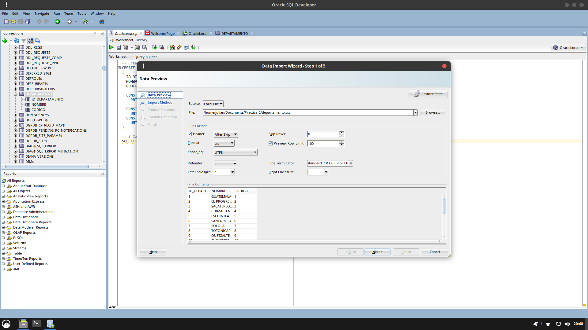
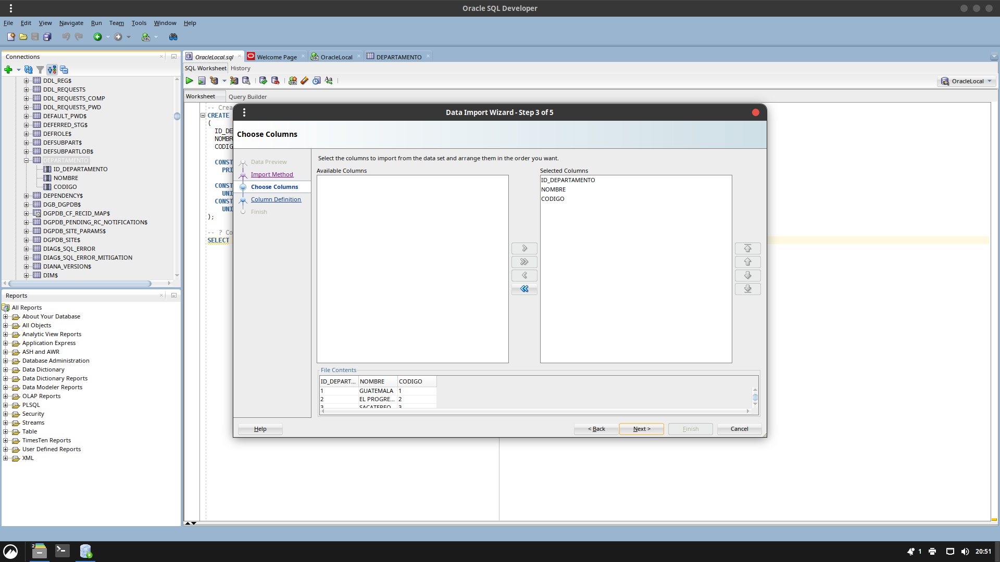
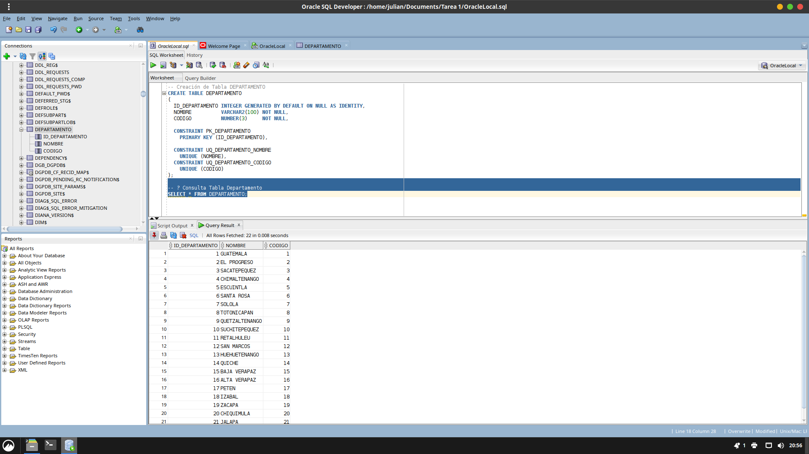

# 📊 Manual de Procedimiento de Carga de Datos

## Información del Documento

| Campo | Detalle |
|:------|:--------|
| **Sistema** | Departamento de Tránsito de Guatemala |
| **Carné del Alumno** | 201905884 |
| **Autor** | Sistema de Base de Datos - Laboratorio 1 |
| **Fecha de Elaboración** | Guatemala, marzo de 2026 |
| **Versión** | 1.0 |

---

## 📑 Tabla de Contenidos

### 🎯 Planificación
1. [Objetivo General](#objetivo-general)
2. [Objetivos Específicos](#objetivos-específicos)
3. [Introducción](#introducción)

### ⚙️ Preparación
4. [Requisitos Previos](#requisitos-previos)
5. [Configuración del Entorno](#configuración-del-entorno)

### 💾 Conceptos SQL
6. [SQL DDL y DML](#sql-ddl-y-dml)
   - [Lenguaje de Definición de Datos (DDL)](#sql-ddl)
   - [Lenguaje de Manipulación de Datos (DML)](#sql-dml)

### 🗂️ Estructura de Base de Datos
7. [Creación de las Tablas](#creación-de-las-tablas)
   - [Tablas Independientes (Padre)](#tablas-padre)
     - [DEPARTAMENTO](#departamento)
     - [ESCUELA](#escuela)
     - [CENTRO](#centro)
     - [CORRELATIVO](#correlativo)
     - [PREGUNTAS (Examen Teórico)](#preguntas-examen-teórico)
     - [PREGUNTAS PRACTICUM](#preguntas-practico)
   - [Tablas Dependientes (Hijo)](#tablas-hijas)
     - [MUNICIPIO](#municipio)
     - [UBICACION](#ubicacion)
     - [REGISTRO](#registro)
     - [EXAMEN](#examen)
   - [Tablas de Respuestas](#respuestas-del-examen)
     - [RESPUESTA\_USUARIO](#respuesta_usuario)
     - [RESPUESTA\_PRACTICUM\_USUARIO](#respuesta_practico_usuario)

### 📥 Ejecución
8. [Inserción de Datos en Oracle SQL Developer](#inserción-de-datos-en-oracle-sql-developer)

### 📋 Cierre
9. [Conclusiones](#conclusiones)
10. [Referencias y Recursos](#referencias-y-recursos)

---

---

## 🎯 Objetivo General

Implementar el modelo de base de datos relacional para el **Sistema del Departamento de Tránsito de Guatemala**, documentando de forma exhaustiva el proceso de creación de la estructura de tablas, establecimiento de restricciones de integridad y carga de datos transaccionales.

---

## 📌 Objetivos Específicos

El presente documento se enfoca en alcanzar los siguientes objetivos específicos:

- ✔️ **Configurar** un entorno Oracle Database funcional y optimizado
- ✔️ **Diseñar e implementar** el modelo relacional de acuerdo con las especificaciones de diseño
- ✔️ **Cargar** datos transaccionales desde fuentes externas (archivo Excel) hacia la base de datos
- ✔️ **Validar** la integridad referencial mediante restricciones (constraints)
- ✔️ **Ejecutar** consultas SQL de validación sobre los datos cargados

---

## 📖 Introducción

Este manual proporciona una guía integral y paso a paso para el proceso completo de implementación de una base de datos Oracle, cubriendo desde la preparación del entorno hasta la carga final de datos. 

El documento incluye:
- **Configuración inicial** del entorno de trabajo
- **Conceptos fundamentales** de SQL DDL y DML
- **Especificaciones técnicas** de cada tabla y sus relaciones
- **Scripts SQL listos para ejecutar** con ejemplos de datos

Se explica el rol del **SQL DDL** (Lenguaje de Definición de Datos) para crear y modificar la estructura, y el **SQL DML** (Lenguaje de Manipulación de Datos) para gestionar los registros almacenados.

---

## ⚙️ Requisitos Previos

Antes de iniciar el proceso de implementación, asegúrese de contar con los siguientes requisitos:

| Requisito | Descripción | Versión Mínima |
|:----------|:-----------|:---------------:|
| 🗄️ Oracle Database | Motor de base de datos instalado y en ejecución | 11g o superior |
| 💻 Oracle SQL Developer | Herramienta gráfica para administración y consultas SQL | 19.2+ |
| 🔐 Permisos de Usuario | Credenciales con permisos de creación de tablas | Nivel DBA |
| 📊 Archivo de Datos | `DATA_inicial.xlsx` disponible en el equipo local | Excel 2016+ |
| 💾 Espacio en Disco | Mínimo 2 GB de espacio libre en el servidor | Recomendado 5 GB |

---

## 🛠️ Configuración del Entorno

### Pasos Preliminares

1. **Instalar Oracle Database XE**
   - Descargar desde el sitio oficial de Oracle
   - Seguir el instalador con configuración por defecto
   - Anotar la contraseña del usuario SYSTEM

2. **Instalar Oracle SQL Developer**
   - Descargar la versión compatible con su sistema operativo
   - Extraer en directorio sin restricciones de permisos
   - Ejecutar `sqldeveloper.exe`

3. **Crear Conexión a la Base de Datos**
   - Abrir Oracle SQL Developer
   - Crear nueva conexión con los siguientes parámetros:
     - **Nombre**: Conexión Local
     - **Usuario**: SYSTEM
     - **Contraseña**: [La ingresada durante instalación]
     - **Nombre de Host**: localhost
     - **Puerto**: 1521
     - **SID**: xe (para XE) u ORCL (para versiones completas)

4. **Preparar el Archivo Excel**
   - Verificar que `DATA_inicial.xlsx` esté en una ruta accesible
   - Asegurarse de que no esté abierto en otras aplicaciones

---

## 💾 Lenguajes SQL: DDL y DML

### DDL: Lenguaje de Definición de Datos

El **DDL (Data Definition Language)** es el conjunto de sentencias SQL utilizadas para definir, modificar y eliminar la estructura de los objetos de la base de datos. 

**Comandos Principales:**

| Comando | Descripción | Ejemplo de Uso |
|:--------|:-----------|:---------------:|
| `CREATE TABLE` | Crea nuevas tablas en la base de datos | Crear estructura de datos |
| `ALTER TABLE` | Modifica la estructura de una tabla existente | Agregar o eliminar columnas |
| `DROP TABLE` | Elimina una tabla y todos sus datos | Remover objetos obsoletos |
| `CREATE INDEX` | Crea índices para optimizar búsquedas | Mejorar rendimiento de consultas |
| `CREATE CONSTRAINT` | Define restricciones de integridad | Garantizar validez de datos |

**Características clave:**
- Define la estructura y esquema de la base de datos
- Establece restricciones de integridad (PK, FK, UNIQUE, CHECK)
- Se executa generalmente una sola vez durante implementación

---

### DML: Lenguaje de Manipulación de Datos

El **DML (Data Manipulation Language)** comprende las sentencias SQL utilizadas para manipular (insertar, actualizar, eliminar y consultar) los datos almacenados en las tablas.

**Comandos Principales:**

| Comando | Descripción | Ejemplo de Uso |
|:--------|:-----------|:---------------:|
| `INSERT INTO` | Inserta nuevas filas de datos en una tabla | Agregar registro de un examen |
| `UPDATE` | Modifica datos existentes en una tabla | Actualizar información de usuario |
| `DELETE FROM` | Elimina filas de una tabla | Remover registros específicos |
| `SELECT` | Recupera y consulta datos de una o más tablas | Generar reportes o búsquedas |

**Características clave:**
- Manipula los datos sin afectar la estructura
- Se ejecuta de forma repetida durante la vida útil de la BD
- Sujeto a restricciones DDL para mantener integridad

---

<div style="page-break-after: always;"></div>

## 🗂️ Creación de las Tablas de la Base de Datos

El modelo relacional se divide en dos categorías principales de tablas, organizadas según sus dependencias y relaciones:

### 📦 Tablas Independientes (Padre/Maestro)

Las **tablas padre o maestro** son aquellas que **no dependen de ningúna otra tabla** mediante llave foránea (Foreign Key). Estas tablas forman la base de la estructura relacional y deben ser creadas primero.

**Características:**
- No poseen llaves foráneas hacia otras tablas
- Su clave primaria es referenciada por otras tablas
- Pueden ser eliminadas solo si no tienen referencias activas
- Incluyen datos de referencia y configuración del sistema

---

#### DEPARTAMENTO

**Descripción:** Tabla que almacena los departamentos geográficos donde operan los centros de examen.

```sql
-- Creación de Tabla DEPARTAMENTO
CREATE TABLE DEPARTAMENTO
(
  ID_DEPARTAMENTO INTEGER GENERATED BY DEFAULT ON NULL AS IDENTITY,
  NOMBRE          VARCHAR2(100) NOT NULL,
  CODIGO          NUMBER(3)     NOT NULL,

  CONSTRAINT PK_DEPARTAMENTO
    PRIMARY KEY (ID_DEPARTAMENTO),

  CONSTRAINT UQ_DEPARTAMENTO_NOMBRE
    UNIQUE (NOMBRE),

  CONSTRAINT UQ_DEPARTAMENTO_CODIGO
    UNIQUE (CODIGO)
);

-- Inserción de datos en DEPARTAMENTO
INSERT INTO DEPARTAMENTO (NOMBRE, CODIGO)
  VALUES ('Guatemala', 1);
```

---

#### ESCUELA

**Descripción:** Tabla que registra los establecimientos educativos acreditados como centros de capacitación para licencia de conducir.

```sql
-- Creación de Tabla ESCUELA
CREATE TABLE ESCUELA
(
  ID_ESCUELA INTEGER GENERATED BY DEFAULT ON NULL AS IDENTITY,
  NOMBRE     VARCHAR2(100) NOT NULL,
  DIRECCION  VARCHAR2(200) NOT NULL,
  ACUERDO    VARCHAR2(50)  NOT NULL,

  CONSTRAINT PK_ESCUELA
    PRIMARY KEY (ID_ESCUELA)
);

-- Inserción de datos en ESCUELA
INSERT INTO ESCUELA (NOMBRE, DIRECCION, ACUERDO)
  VALUES ('ESCUELA1', 'GUATEMALA ZONA 1', 'A-03-2023');
```

---

#### CENTRO

**Descripción:** Tabla que identifica los centros físicos de evaluación dentro de cada escuela.

```sql
-- Creación de Tabla CENTRO
CREATE TABLE CENTRO
(
  ID_CENTRO INTEGER GENERATED BY DEFAULT ON NULL AS IDENTITY,
  NOMBRE    VARCHAR2(100) NOT NULL,

  CONSTRAINT PK_CENTRO
    PRIMARY KEY (ID_CENTRO)
);

-- Inserción de datos en CENTRO
INSERT INTO CENTRO (NOMBRE)
  VALUES ('CENTRO1');
```

---

#### CORRELATIVO

**Descripción:** Tabla auxiliar que asigna números consecutivos y únicos a cada examen realizado, junto con la fecha de aplicación.

```sql
-- Creación de Tabla CORRELATIVO
CREATE TABLE CORRELATIVO
(
  ID_CORRELATIVO INTEGER GENERATED BY DEFAULT ON NULL AS IDENTITY,
  FECHA          DATE       NOT NULL,
  NO_EXAMEN      NUMBER(10) NOT NULL,

  CONSTRAINT PK_CORRELATIVO
    PRIMARY KEY (ID_CORRELATIVO),

  CONSTRAINT UQ_CORRELATIVO_NUMERO
    UNIQUE (NO_EXAMEN)
);

-- Inserción de datos en CORRELATIVO
INSERT INTO CORRELATIVO (FECHA, NO_EXAMEN)
  VALUES (TO_DATE('2024-06-01', 'YYYY-MM-DD'), 1);
```

---

#### PREGUNTAS (Examen Teórico)

**Descripción:** Tabla que almacena las preguntas de opción múltiple del examen teórico de licencia de conducir. Posee capacidad de 1 a 4 opciones de respuesta.

**Notas especiales:**
- Las preguntas pueden tener menos de 4 opciones de respuesta
- La respuesta correcta se indica mediante un número del 1 al 4
- Se incluyen restricciones (CHECK) para validar coherencia entre opciones y respuesta correcta

```sql
-- Creación de Tabla PREGUNTAS
CREATE TABLE PREGUNTAS
(
  ID_PREGUNTA    INTEGER GENERATED BY DEFAULT ON NULL AS IDENTITY,
  PREGUNTA_TEXTO VARCHAR2(200) NOT NULL,
  RESPUESTA      NUMBER(1)     NOT NULL,
  RES1           VARCHAR2(100)     NULL,
  RES2           VARCHAR2(100)     NULL,
  RES3           VARCHAR2(100)     NULL,
  RES4           VARCHAR2(100)     NULL,

  CONSTRAINT PK_PREGUNTAS
    PRIMARY KEY (ID_PREGUNTA),

  CONSTRAINT CK_PREGUNTAS_RESP
    CHECK (RESPUESTA BETWEEN 1 AND 4),

  CONSTRAINT CK_PREGUNTAS_RESP_OPCIONES
    CHECK (
      RESPUESTA IS NULL
      OR (RESPUESTA = 1 AND RES1 IS NOT NULL)
      OR (RESPUESTA = 2 AND RES2 IS NOT NULL)
      OR (RESPUESTA = 3 AND RES3 IS NOT NULL)
      OR (RESPUESTA = 4 AND RES4 IS NOT NULL)
    )
);

-- Inserción de datos en PREGUNTAS
INSERT INTO PREGUNTAS (PREGUNTA_TEXTO, RESPUESTA, RES1, RES2, RES3, RES4)
VALUES (q'[¿POR SU PESO COMO SE CLASIFICA UNA MOTOCICLETA?]', 2,
        q'[Pesada]',
        q'[Ligero]',
        q'[Especial]',
        q'[Ninguna es correcta]');
```

---

#### PREGUNTAS PRACTICUM

**Descripción:** Tabla que almacena los items o tareas del examen práctico que debe realizar el aspirante (manejo real del vehículo). Cada pregunta tiene un puntaje asociado que se utiliza en la evaluación.

**Características:**
- Preguntas de tipo escala dicotómica (cumple/no cumple)
- Cada pregunta tiene un valor en puntos para la evaluación final

```sql
-- Creación de Tabla PREGUNTAS_PRACTICO
CREATE TABLE PREGUNTAS_PRACTICO
(
  ID_PREGUNTA_PRACTICO INTEGER GENERATED BY DEFAULT ON NULL AS IDENTITY,
  PREGUNTA_TEXTO       VARCHAR2(200) NOT NULL,
  PUNTEO               NUMBER(3)     NOT NULL,

  CONSTRAINT PK_PREGUNTAS_PRACTICO
    PRIMARY KEY (ID_PREGUNTA_PRACTICO)
);

-- Inserción de datos en PREGUNTAS_PRACTICO
INSERT INTO PREGUNTAS_PRACTICO (PREGUNTA_TEXTO, PUNTEO)
VALUES (q'[Abrochó y colocó correctamente cinturón de seguridad]', 10);
```

---

<div style="page-break-after: always;"></div>

### 🔗 Tablas Dependientes (Hijo/Detalle)

Las **tablas hijo o detalle** son aquellas que **dependen de una o más tablas padre** mediante llaves foráneas (Foreign Keys). Estas tablas representan entidades que extienden o detallan información de las tablas principales.

**Características:**
- Contienen una o más llaves foráneas hacia tablas padre
- Deben ser creadas DESPUÉS de sus tablas padre
- La integridad referencial se mantiene mediante constraints
- Se pueden configurar acciones en cascada (ON DELETE CASCADE)

---

#### MUNICIPIO

**Descripción:** Tabla que registra los municipios dentro de cada departamento del país. Cada municipio está asociado a un departamento específico.

**Relación:** Referencia a `DEPARTAMENTO` mediante llave foránea

```sql
-- Creación de Tabla MUNICIPIO
CREATE TABLE MUNICIPIO
(
  ID_MUNICIPIO                 INTEGER GENERATED BY DEFAULT ON NULL AS IDENTITY,
  DEPARTAMENTO_ID_DEPARTAMENTO INTEGER       NOT NULL,
  NOMBRE                       VARCHAR2(100) NOT NULL,
  CODIGO                       NUMBER(3)     NOT NULL,

  CONSTRAINT PK_MUNICIPIO
    PRIMARY KEY (ID_MUNICIPIO),

  CONSTRAINT FK_MUNICIPIO_DEPARTAMENTO
    FOREIGN KEY (DEPARTAMENTO_ID_DEPARTAMENTO)
    REFERENCES DEPARTAMENTO(ID_DEPARTAMENTO)
    ON DELETE CASCADE,

  CONSTRAINT UQ_MUNICIPIO_DEP_COD
    UNIQUE (DEPARTAMENTO_ID_DEPARTAMENTO, CODIGO),

  CONSTRAINT UQ_MUNICIPIO_ID_DEP
    UNIQUE (ID_MUNICIPIO, DEPARTAMENTO_ID_DEPARTAMENTO)
);

-- Inserción de datos en MUNICIPIO
INSERT INTO MUNICIPIO (DEPARTAMENTO_ID_DEPARTAMENTO, NOMBRE, CODIGO)
  VALUES (1, 'GUATEMALA', 1);
```

---

#### UBICACION

**Descripción:** Tabla de asociación que relaciona escuelas con los centros de examen donde operan. Esta es una tabla de relación muchos-a-muchos que establece dónde cada escuela tiene presencia.

**Relaciones:** 
- Referencia a `ESCUELA` mediante llave foránea
- Referencia a `CENTRO` mediante llave foránea

```sql
-- Creación de Tabla UBICACION
CREATE TABLE UBICACION
(
  ESCUELA_ID_ESCUELA INTEGER NOT NULL,
  CENTRO_ID_CENTRO   INTEGER NOT NULL,

  CONSTRAINT PK_UBICACION
    PRIMARY KEY (ESCUELA_ID_ESCUELA, CENTRO_ID_CENTRO),

  CONSTRAINT FK_UBICACION_ESCUELA
    FOREIGN KEY (ESCUELA_ID_ESCUELA)
    REFERENCES ESCUELA(ID_ESCUELA)
    ON DELETE CASCADE,

  CONSTRAINT FK_UBICACION_CENTRO
    FOREIGN KEY (CENTRO_ID_CENTRO)
    REFERENCES CENTRO(ID_CENTRO)
    ON DELETE CASCADE
);

-- Inserción de datos en UBICACION
INSERT INTO UBICACION (ESCUELA_ID_ESCUELA, CENTRO_ID_CENTRO)
  VALUES (1, 1);
```

---

#### REGISTRO

**Descripción:** Tabla que almacena el registro de cada persona que se presenta a rendir examen. Contiene información demográfica del aspirante, tipo de licencia solicitada, tipo de trámite y ubicación del centro donde realiza el examen.

**Relaciones:**
- Referencia a `UBICACION` (ESCUELA y CENTRO)
- Referencia a `MUNICIPIO` (para la ubicación geográfica del aspirante)

**Campos especiales:**
- `TIPO_TRAMITE`: Indica si es primer licencia, renovación, etc.
- `TIPO_LICENCIA`: Clasificación de licencia (A, B, C, D, E, etc.)
- `GENERO`: M (Masculino) o F (Femenino)

```sql
-- Creación de Tabla REGISTRO
CREATE TABLE REGISTRO
(
  ID_REGISTRO                            INTEGER GENERATED BY DEFAULT ON NULL AS IDENTITY,
  UBICACION_ESCUELA_ID_ESCUELA           INTEGER       NOT NULL,
  UBICACION_CENTRO_ID_CENTRO             INTEGER       NOT NULL,
  MUNICIPIO_ID_MUNICIPIO                 INTEGER       NOT NULL,
  MUNICIPIO_DEPARTAMENTO_ID_DEPARTAMENTO INTEGER       NOT NULL,
  FECHA                                  DATE          NOT NULL,
  TIPO_TRAMITE                           VARCHAR2(30)  NOT NULL,
  TIPO_LICENCIA                          CHAR(1)       NOT NULL,
  NOMBRE_COMPLETO                        VARCHAR2(100) NOT NULL,
  GENERO                                 CHAR(1)       NOT NULL,

  CONSTRAINT PK_REGISTRO
    PRIMARY KEY (ID_REGISTRO),

  CONSTRAINT FK_REGISTRO_UBICACION
    FOREIGN KEY (UBICACION_ESCUELA_ID_ESCUELA, UBICACION_CENTRO_ID_CENTRO)
    REFERENCES UBICACION(ESCUELA_ID_ESCUELA, CENTRO_ID_CENTRO)
    ON DELETE CASCADE,

  CONSTRAINT FK_REGISTRO_MUNICIPIO_DEP
    FOREIGN KEY (MUNICIPIO_ID_MUNICIPIO, MUNICIPIO_DEPARTAMENTO_ID_DEPARTAMENTO)
    REFERENCES MUNICIPIO(ID_MUNICIPIO, DEPARTAMENTO_ID_DEPARTAMENTO),

  CONSTRAINT CK_REGISTRO_GENERO
    CHECK (GENERO IN ('M', 'F'))
);

-- Inserción de datos en REGISTRO
INSERT INTO REGISTRO (
  UBICACION_ESCUELA_ID_ESCUELA,
  UBICACION_CENTRO_ID_CENTRO,
  MUNICIPIO_ID_MUNICIPIO,
  MUNICIPIO_DEPARTAMENTO_ID_DEPARTAMENTO,
  FECHA,
  TIPO_TRAMITE,
  TIPO_LICENCIA,
  NOMBRE_COMPLETO,
  GENERO
)
VALUES (
  1, 1, 1, 1,
  TO_DATE('2024-06-01', 'YYYY-MM-DD'),
  'PRIMER_LICENCIA', 'C', 'JUAN PEREZ', 'M'
);
```

---

#### EXAMEN

**Descripción:** Tabla que registra cada examen realizado, vinculando el registro del aspirante con un número de correlativo único. Es la tabla central que conecta a los aspirantes con sus respuestas.

**Relaciones:**
- Referencia a `REGISTRO` (aspirante que realiza el examen)
- Referencia a `CORRELATIVO` (número único del examen)
- Referencia a `UBICACION` (lugar donde se realiza)
- Referencia a `MUNICIPIO` (ubicación geográfica)

**Restricciones especiales:**
- El `CORRELATIVO_ID_CORRELATIVO` debe ser único (cada examen tiene un correlativo)
- Una vez creado el examen, no puede eliminarse si tiene respuestas asociadas

```sql
-- Creación de Tabla EXAMEN
CREATE TABLE EXAMEN
(
  ID_EXAMEN                                       INTEGER GENERATED BY DEFAULT ON NULL AS IDENTITY,
  REGISTRO_ID_ESCUELA                             INTEGER NOT NULL,
  REGISTRO_ID_CENTRO                              INTEGER NOT NULL,
  REGISTRO_MUNICIPIO_ID_MUNICIPIO                 INTEGER NOT NULL,
  REGISTRO_MUNICIPIO_DEPARTAMENTO_ID_DEPARTAMENTO INTEGER NOT NULL,
  REGISTRO_ID_REGISTRO                            INTEGER NOT NULL,
  CORRELATIVO_ID_CORRELATIVO                      INTEGER NOT NULL,

  CONSTRAINT PK_EXAMEN
    PRIMARY KEY (ID_EXAMEN),

  CONSTRAINT FK_EXAMEN_REGISTRO
    FOREIGN KEY (REGISTRO_ID_REGISTRO)
    REFERENCES REGISTRO(ID_REGISTRO)
    ON DELETE CASCADE,

  CONSTRAINT FK_EXAMEN_CORRELATIVO
    FOREIGN KEY (CORRELATIVO_ID_CORRELATIVO)
    REFERENCES CORRELATIVO(ID_CORRELATIVO)
    ON DELETE CASCADE,

  CONSTRAINT UQ_EXAMEN_CORRELATIVO
    UNIQUE (CORRELATIVO_ID_CORRELATIVO),

  CONSTRAINT FK_EXAMEN_UBICACION
    FOREIGN KEY (REGISTRO_ID_ESCUELA, REGISTRO_ID_CENTRO)
    REFERENCES UBICACION(ESCUELA_ID_ESCUELA, CENTRO_ID_CENTRO),

  CONSTRAINT FK_EXAMEN_MUNICIPIO_DEP
    FOREIGN KEY (REGISTRO_MUNICIPIO_ID_MUNICIPIO, REGISTRO_MUNICIPIO_DEPARTAMENTO_ID_DEPARTAMENTO)
    REFERENCES MUNICIPIO(ID_MUNICIPIO, DEPARTAMENTO_ID_DEPARTAMENTO)
);

-- Inserción de datos en EXAMEN
INSERT INTO EXAMEN (REGISTRO_ID_REGISTRO, CORRELATIVO_ID_CORRELATIVO)
  VALUES (1, 1);
```

---

<div style="page-break-after: always;"></div>

### 📝 Tablas de Respuestas

Las **tablas de respuestas** almacenan el desempeño del aspirante en cada examen, creando un registro detallado de cómo respondió cada pregunta.

---

#### RESPUESTA\_USUARIO

**Descripción:** Tabla que registra la respuesta del aspirante a cada pregunta del examen teórico. Permite posteriormente verificar si la respuesta es correcta y calcular la calificación.

**Relaciones:**
- Referencia a `PREGUNTAS` (pregunta del examen)
- Referencia a `EXAMEN` (examen que está respondiendo)

**Restricciones:**
- Las respuestas deben estar entre 1 y 4 (opciones válidas)
- No puede haber dos respuestas del mismo aspirante a la misma pregunta en un examen (UNIQUE)

```sql
-- Creación de Tabla RESPUESTA_USUARIO
CREATE TABLE RESPUESTA_USUARIO
(
  ID_RESPUESTA_USUARIO INTEGER GENERATED BY DEFAULT ON NULL AS IDENTITY,
  PREGUNTA_ID_PREGUNTA INTEGER   NOT NULL,
  EXAMEN_ID_EXAMEN     INTEGER   NOT NULL,
  RESPUESTA            NUMBER(1) NOT NULL,

  CONSTRAINT PK_RESPUESTA_USUARIO
    PRIMARY KEY (ID_RESPUESTA_USUARIO),

  CONSTRAINT FK_RESP_USUARIO_PREGUNTA
    FOREIGN KEY (PREGUNTA_ID_PREGUNTA)
    REFERENCES PREGUNTAS(ID_PREGUNTA),

  CONSTRAINT FK_RESP_USUARIO_EXAMEN
    FOREIGN KEY (EXAMEN_ID_EXAMEN)
    REFERENCES EXAMEN(ID_EXAMEN)
    ON DELETE CASCADE,

  CONSTRAINT CK_RESP_USUARIO_RESP
    CHECK (RESPUESTA BETWEEN 1 AND 4),

  CONSTRAINT UQ_RESP_USUARIO_EXAMEN_PREG
    UNIQUE (EXAMEN_ID_EXAMEN, PREGUNTA_ID_PREGUNTA)
);

-- Inserción de datos en RESPUESTA_USUARIO
INSERT INTO RESPUESTA_USUARIO (PREGUNTA_ID_PREGUNTA, EXAMEN_ID_EXAMEN, RESPUESTA)
  VALUES (1, 1, 3);
```

---

#### RESPUESTA\_PRACTICUM\_USUARIO

**Descripción:** Tabla que registra la evaluación del aspirante en cada pregunta/item del examen práctico de manejo. Almacena la nota obtenida por cada comportamiento evaluado durante la prueba de conducción.

**Relaciones:**
- Referencia a `PREGUNTAS_PRACTICO` (pregunta práctico del examen)
- Referencia a `EXAMEN` (examen al que corresponde)

**Campos especiales:**
- `NOTA`: Puntuación obtenida en ese comportamiento (0 a puntos_totales)

```sql
-- Creación de Tabla RESPUESTA_PRACTICO_USUARIO
CREATE TABLE RESPUESTA_PRACTICO_USUARIO
(
  ID_RESPUESTA_PRACTICO                  INTEGER GENERATED BY DEFAULT ON NULL AS IDENTITY,
  PREGUNTA_PRACTICO_ID_PREGUNTA_PRACTICO INTEGER   NOT NULL,
  EXAMEN_ID_EXAMEN                       INTEGER   NOT NULL,
  NOTA                                   NUMBER(3) NOT NULL,

  CONSTRAINT PK_RESPUESTA_PRACTICO_USUARIO
    PRIMARY KEY (ID_RESPUESTA_PRACTICO),

  CONSTRAINT FK_RESP_PRACTICO_PREG
    FOREIGN KEY (PREGUNTA_PRACTICO_ID_PREGUNTA_PRACTICO)
    REFERENCES PREGUNTAS_PRACTICO(ID_PREGUNTA_PRACTICO),

  CONSTRAINT FK_RESP_PRACTICO_EXAMEN
    FOREIGN KEY (EXAMEN_ID_EXAMEN)
    REFERENCES EXAMEN(ID_EXAMEN)
    ON DELETE CASCADE,

  CONSTRAINT UQ_RESP_PRACTICO_EXAMEN_PREG
    UNIQUE (EXAMEN_ID_EXAMEN, PREGUNTA_PRACTICO_ID_PREGUNTA_PRACTICO)
);

-- Inserción de datos en RESPUESTA_PRACTICO_USUARIO
INSERT INTO RESPUESTA_PRACTICO_USUARIO (PREGUNTA_PRACTICO_ID_PREGUNTA_PRACTICO, EXAMEN_ID_EXAMEN, NOTA)
  VALUES (1, 1, 9);
```

---

<div style="page-break-after: always;"></div>

## 📥 Inserción de Datos en Oracle SQL Developer

Esta sección guía el proceso de carga de datos en la base de datos, tanto mediante scripts SQL que pueden reproducirse, como a través de la importación de datos desde archivos externos.

### 📋 Paso 1 — Crear la Estructura de Tablas

El primer paso es crear la estructura completa de la base de datos ejecutando todo el código DDL.

**Procedimiento:**

1. Abrir **Oracle SQL Developer** en su equipo local
2. Conectarse a la base de datos usando credenciales válidas (usuario SYSTEM o similar)
3. En la pestaña **Worksheet**, crear un **nuevo script SQL**
4. **Copiar y pegar** todo el código SQL de creación de tablas (DDL) incluido en este manual
5. **Ejecutar el script completo** presionando el botón **Run Script** (F5)
6. Verificar que no haya errores en la ventana **Messages**

```sql
-- Ejemplo: Ejecución de DDL
-- El sistema creará tabla por tabla respetando las restricciones
CREATE TABLE DEPARTAMENTO (...);
CREATE TABLE MUNICIPIO (...);
-- ... continúa con el resto de tablas
```

**Resultado esperado:**
- ✅ Todas las tablas creadas exitosamente
- ✅ Constraints definidos y activos
- ✅ Índices de claves primarias generados automáticamente


---

### 🔄 Paso 2 — Importar Datos desde Archivo Excel

Una vez creada la estructura, se procede a cargar los datos desde el archivo Excel.

**Pre-requisitos:**
- Archivo `DATA_inicial.xlsx` disponible y accesible
- Archivo no debe estar abierto en Excel durante la importación
- Estructura del Excel debe coincidir con las columnas de las tablas

**Procedimiento Detallado:**

1. **Iniciar el asistente de importación**
   - Clic derecho sobre la tabla destino en el navegador
   - Seleccionar **Import Data**


2. **Seleccionar el archivo fuente**
   - Navegar a la ubicación del archivo `DATA_inicial.xlsx`
   - Seleccionar el archivo y abrir


3. **Configurar el método de importación**
   - Seleccionar formato **CSV** como intermediario
   - Verificar la **previsualización** de los datos
   - Confirmar que los datos se visualicen correctamente



4. **Definir parámetros de carga**
   - Seleccionar método **Insert** para generar sentencias INSERT
   - Especificar límite de filas por lote (ejemplo: 1000 filas)
   - Esto genera un script SQL que puede ser revisado antes de ejecutar

5. **Mapear columnas**
   - Hacer corresponder cada columna del archivo Excel con un campo de la tabla
   - Verificar que los tipos de datos sean compatibles



6. **Definir formato de campos**
   - Para columnas de fecha: especificar formato (ejemplo: DD/MM/YYYY)
   - Para campos numéricos: definir separador decimal
   - Establecer valores nulos si aplica


7. **Revisar resumen y confirmar**
   - Revisar el resumen de la configuración
   - Clickear **Finish** para completar la importación
   - El sistema ejecutará los INSERT automáticamente


**Resultado esperado:**
- ✅ Datos cargados en las tablas especificadas
- ✅ Integridad referencial mantenida
- ✅ Número de filas insertadas coincide con el esperado

---

### ✔️ Paso 3 — Verificación de Datos Insertados

Después de completar la carga, se recomienda verificar que los datos se hayan insertado correctamente.

**Consultas de verificación:**

```sql
-- Ver cantidad de registros en DEPARTAMENTO
SELECT COUNT(*) AS Total_Registros FROM DEPARTAMENTO;
Result: 1 registro

-- Ver cantidad de registros en MUNICIPIO
SELECT COUNT(*) AS Total_Registros FROM MUNICIPIO;
Result: 1 registro

-- Consulta detallada de REGISTROS
SELECT 
    R.ID_REGISTRO,
    R.NOMBRE_COMPLETO,
    R.TIPO_LICENCIA,
    D.NOMBRE AS DEPARTAMENTO,
    M.NOMBRE AS MUNICIPIO
FROM REGISTRO R
INNER JOIN MUNICIPIO M ON R.MUNICIPIO_ID_MUNICIPIO = M.ID_MUNICIPIO
INNER JOIN DEPARTAMENTO D ON M.DEPARTAMENTO_ID_DEPARTAMENTO = D.ID_DEPARTAMENTO;
```



**Checklist de validación:**

| Validación | Estado |
|:-----------|:------:|
| Tablas creadas | ✅ |
| Datos importados | ✅ |
| Integridad referencial | ✅ |
| Claves únicas válidas | ✅ |
| Sin datos duplicados | ✅ |

---

### Paso 3 — Verificación de datos insertados

Ejecutar una consulta de verificación para confirmar que los datos fueron cargados correctamente:

```sql
SELECT * FROM DEPARTAMENTO;
```


---

<div style="page-break-after: always;"></div>

## ✅ Conclusiones

El presente manual sirve como guía completa para la implementación de una base de datos relacional funcional y robusta para el Departamento de Tránsito de Guatemala. 

### Aspectos Clave Implementados

✔️ **Diseño Relacional Completo**
- Se ha documentado una estructura de 12 tablas con relaciones bien definidas
- Las tablas padre y dependientes mantienen integridad referencial mediante constraints

✔️ **Restricciones de Integridad**
- Claves primarias (PRIMARY KEY) garantizan unicidad
- Claves foráneas (FOREIGN KEY) mantienen consistencia referencial
- Restricciones CHECK validan valores permitidos
- Restricciones UNIQUE previenen duplicados

✔️ **Mantenimiento de Datos**
- Scripts SQL DDL listos para ejecutar
- Ejemplos de carga de datos con SQL DML
- Proceso de importación desde Excel documentado paso a paso

### Recomendaciones para la Continuidad

1. **Realizar copias de seguridad** periódicamente de la base de datos
2. **Documentar cambios** en la estructura al momento de realizarlos
3. **Optimizar índices** una vez se tengan datos en volumen
4. **Validar restricciones** regularmente para mantener integridad
5. **Revisar logs** de error en Oracle para detectar problemas tempranamente

### Beneficios de la Implementación

- ✨ **Integridad de Datos**: Garantizada mediante constraints a nivel de base de datos
- 🚀 **Escalabilidad**: Estructura preparada para crecimiento de datos
- 📊 **Análisis**: Relaciones bien definidas facilitan reportes y consultas complejas
- 📝 **Trazabilidad**: Cada registro queda documentado con fecha y ubicación

---

## 📚 Referencias y Recursos

### Documentación Oficial

- **Oracle Database Documentation**: https://docs.oracle.com/database/
- **SQL Language Reference**: https://docs.oracle.com/en/database/oracle/oracle-database/
- **Oracle SQL Developer Help**: Incluido en la instalación de SQL Developer

### Conceptos Clave Utilizados

| Concepto | Definición | Referencia |
|:---------|:-----------|:----------:|
| **Integridad Referencial** | Mecanismo para garantizar consistencia entre tablas relacionadas | Teoría de BD Relacional |
| **Llave Primaria (PK)** | Identificador único que garantiza cada registro es irrepetible | ACID Properties |
| **Llave Foránea (FK)** | Referencia a clave primaria de otra tabla | Entity-Relationship Model |
| **ON DELETE CASCADE** | Elimina registros dependientes automáticamente | Acción Declarativa |
| **IDENTITY/AUTO_INCREMENT** | Asignación automática de valores secuenciales | Funcionalidad RDBMS |

### Herramientas Utiliza das

- **Oracle Database XE**: Motor de base de datos gratuito
- **Oracle SQL Developer**: IDE para administración y desarrollo SQL
- **Microsoft Excel**: Fuente de datos para importación

### Próximos Pasos Sugeridos

1. Crear vistas (VIEWS) para consultas frecuentes
2. Desarrollar stored procedures para operaciones complejas
3. Implementar triggers para automatizar validaciones
4. Crear índices adicionales según patrones de consulta
5. Developed aplicación frontend para captura de datos

---

**Documento Elaborado: Marzo de 2026**
**Estado: Completado y Documentado**
**Clasificación: Académico - Laboratorio 1**
