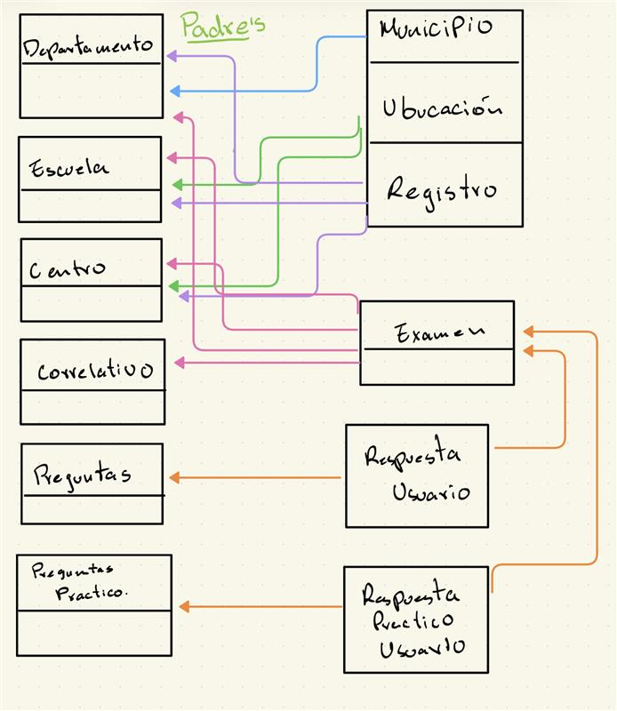

# 📕 Manual de Procedimiento de la carga de datos a la DB.

## Indice
  - [Objetivo General](#objetivo-general)
  - [Objetivos Específicos](#objetivos-específicos)
  - [Introducción](#introducción)
  - [Requisitos previos](#requisitos-previos)
  - [Configuración del entorno](#configuración-del-entorno)
  - [Que es SQL DDL y DML](#que-es-sql-ddl-y-dml)
    - [SQL DLL Commands](#sql-dll-commands)
      - [CREATE](#create)
      - [ALTER](#alter)
      - [DROP](#drop)
  - [SQL CREATE TABLE](#sql-create-table)
  - [CREATE TABLE](#create-table)
    - [Purpose](#purpose)
  - [Creación de la Tablas](#creación-de-la-tablas)
    - [Tablas Padre](#tablas-padre)
      - [Tabla Departamento](#tabla-departamento)
      - [Tabla Escuela](#tabla-escuela)
      - [Tabla Centro](#tabla-centro)
      - [Tabla Correlativo](#tabla-correlativo)
      - [Tabla Preguntas](#tabla-preguntas)
      - [Tabla Preguntas Practico](#tabla-preguntas-practico)
    - [Tablas Hija Nivel 1](#tablas-hija-nivel-1)
      - [Tabla Municipio](#tabla-municipio)
      - [Tabla Ubicacion](#tabla-ubicacion)
      - [Tabla Registro](#tabla-registro)
      - [Tabla Examen](#tabla-examen)
    - [Tablas Hija Nivel 2](#tablas-hija-nivel-2)
      - [Tabla Respuesta Usuario](#tabla-respuesta-usuario)
      - [Tabla Respuesta Practico Usuario](#tabla-respuesta-practico-usuario)

## Objetivo General

- En base al modelo presentado, nos solicitan realizar una serie de reportes para cumplir con informes que
solicita el departamento de tránsito de Guatemala.

## Objetivos Específicos

- Configurar servidor de base de datos para la creación del modelo diseñado anteriormente.
- Cargar datos transaccionales al modelo presentado.
- Generar consultas SQL según lo solicitado.

## Introducción

Este manual abarca hasta el objetivo específico de cargar datos transaccionales al modelo presentado. Para esto se detallará el proceso de carga de datos a la base de datos, incluyendo la preparación de los datos, la conexión a la base de datos y la ejecución de las consultas SQL necesarias para insertar los datos.

## Requisitos previos

- Tener acceso a un servidor de base de datos "Se debe de utilizar el motor de base de datos Oracle".
- Tener permisos de escritura en la base de datos.
- Tener instalado el software de administración de base de datos Oracle (por ejemplo, SQL Developer).
- Tener los datos transaccionales preparados en un formato compatible (por ejemplo, CSV, Excel, etc.).

***Nota:*** El archivo a utilizar para la carga de datos se encuentra en el siguiente enlace: [Datos Transaccionales](../data/DATA_inicial.xlsx)

## Configuración del entorno

1. **Instalación de Oracle Database**: Asegúrate de tener Oracle Database instalado y configurado en tu sistema. Puedes descargarlo desde el sitio oficial de Oracle.

***Nota:*** El link para descargar Oracle Database es el siguiente: [Oracle Database](https://www.oracle.com/es/database/technologies/appdev/xe.html)

2. **Instalación de Oracle SQL Developer**: Descarga e instala Oracle SQL Developer, que es una herramienta gráfica para administrar tu base de datos Oracle.

***Nota:*** El link para descargar Oracle SQL Developer es el siguiente: [Oracle SQL Developer](https://www.oracle.com/database/sqldeveloper/technologies/download/)

3. **Conexión a la base de datos**: Abre Oracle SQL Developer y crea una nueva conexión a tu base de datos Oracle utilizando las credenciales proporcionadas durante la instalación.

4. **Preparación de los datos**: Asegúrate de que los datos transaccionales estén en un formato compatible para la carga. Si es necesario, convierte los datos a un formato como CSV o Excel.

## Que es SQL DDL y DML

- **SQL DDL (Data Definition Language)**: Es un subconjunto de SQL que se utiliza para definir y administrar la estructura de la base de datos. Incluye comandos como `CREATE`, `ALTER`, `DROP`, entre otros, que permiten crear, modificar y eliminar tablas, índices, vistas, etc.

- **SQL DML (Data Manipulation Language)**: Es un subconjunto de SQL que se utiliza para manipular los datos dentro de las tablas de la base de datos. Incluye comandos como `INSERT`, `UPDATE`, `DELETE`, entre otros, que permiten agregar, modificar y eliminar registros en las tablas.

### SQL DDL Commands

> **Corrección #1:** El manual original escribía "SQL DLL Commands" (DLL es incorrecto). El acrónimo correcto es **DDL** (Data Definition Language).

#### CREATE
- El comando `CREATE` se utiliza para crear objetos en la base de datos, como tablas, vistas, índices, etc. Por ejemplo, para crear una tabla llamada "Clientes", se puede usar el siguiente comando:

```sql
CREATE TABLE Clientes (
    ID INT PRIMARY KEY,
    Nombre VARCHAR(50),
    Apellido VARCHAR(50),
    Email VARCHAR(100)
);
```

#### ALTER
- El comando `ALTER` se utiliza para modificar la estructura de una tabla existente. Por ejemplo, para agregar una nueva columna "Telefono" a la tabla "Clientes", se puede usar el siguiente comando:

```sql
ALTER TABLE Clientes
ADD Telefono VARCHAR(20);
```

#### DROP
- El comando `DROP` se utiliza para eliminar objetos de la base de datos, como tablas, vistas, índices, etc. Por ejemplo, para eliminar la tabla "Clientes", se puede usar el siguiente comando:

```sql
DROP TABLE Clientes;
```

## SQL CREATE TABLE

Nos centraremos en el comando `CREATE TABLE`, que es fundamental para definir la estructura de nuestras tablas en la base de datos. Este comando nos permite especificar los nombres de las columnas, sus tipos de datos, restricciones, claves primarias, entre otros aspectos importantes para garantizar la integridad y eficiencia de nuestra base de datos.

***Nota:*** Nos apoyaremos en la documentacion oficial de Oracle para aplicar el comando `CREATE TABLE` con la documentación: [Oracle CREATE TABLE Documentation](https://docs.oracle.com/en/database/oracle/oracle-database/19/sqlrf/CREATE-TABLE.html)

## CREATE TABLE

### Purpose

Utilizar la sentencia **CREATE TABLE** para crear uno de los siguientes tipos de tablas:

- **Una tabla relacional**, que es la estructura básica para almacenar datos de usuario.

- **Una tabla de objetos (object table)**, que es una tabla que utiliza un **object type** como definición para una columna.
  Una **object table** se define explícitamente para almacenar instancias de objetos de un tipo específico.

También puede crear un **object type** y luego utilizarlo en una columna al momento de crear una **tabla relacional**.

Las tablas se crean sin datos, a menos que se especifique una **subquery**.
Puede agregar filas a una tabla utilizando la sentencia **INSERT**.

Después de crear una tabla, se puede definir columnas adicionales, particiones y **integrity constraints** utilizando la cláusula **ADD** de la sentencia **ALTER TABLE**.

Puede cambiar la definición de una columna o partición existente utilizando la cláusula **MODIFY** de la sentencia **ALTER TABLE**.

## Creación de la Tablas

### Tablas Padre



```bash
DEPARTAMENTO
│
└── MUNICIPIO

ESCUELA
CENTRO
│
└── UBICACION (junction entre ESCUELA y CENTRO)
     │
     └── REGISTRO ──── MUNICIPIO
          │
          └── EXAMEN ──── CORRELATIVO
               │
               ├── RESPUESTA_USUARIO ──── PREGUNTAS
               └── RESPUESTA_PRACTICO_USUARIO ──── PREGUNTAS_PRACTICO

PREGUNTAS
PREGUNTAS_PRACTICO
CORRELATIVO
```

#### Tabla Departamento

La tabla DEPARTAMENTO es una tabla padre que almacena información sobre los departamentos de Guatemala.

Contiene los campos de:

- **ID_DEPARTAMENTO:** Es la clave primaria de la tabla, un número entero que se genera automáticamente.
- **NOMBRE:** Es un campo de texto que almacena el nombre del departamento.
- **CODIGO:** es un campo numérico que almacena el código del departamento.

Restricciones:
- El campo CODIGO es un código único que identifica al departamento, por lo que se establece una restricción de clave única en este campo.
- El campo NOMBRE también es un campo único que identifica al departamento, por lo que se establece una restricción de clave única en este campo.

```SQL
CREATE TABLE DEPARTAMENTO
(
    ID_DEPARTAMENTO INTEGER       GENERATED BY DEFAULT ON NULL AS IDENTITY,
    NOMBRE          VARCHAR2(100) NOT NULL,
    CODIGO          NUMBER(3)     NOT NULL,

    CONSTRAINT PK_DEPARTAMENTO
        PRIMARY KEY (ID_DEPARTAMENTO),

    CONSTRAINT UQ_DEPARTAMENTO_NOMBRE
        UNIQUE (NOMBRE),

    CONSTRAINT UQ_DEPARTAMENTO_CODIGO
        UNIQUE (CODIGO)
);
```

#### Tabla Escuela
La tabla ESCUELA es una tabla padre que almacena información sobre las escuelas de conducción en Guatemala.

Contiene los campos de:

- **ID_ESCUELA:** Es la clave primaria de la tabla, un número entero que se genera automáticamente.
- **NOMBRE:** Es un campo de texto que almacena el nombre de la escuela de conducción.
- **DIRECCION:** Es un campo de texto que almacena la dirección de la escuela de conducción.
- **ACUERDO:** Es un campo de texto que almacena el acuerdo de la escuela de conducción con el departamento de tránsito.

Restricciones:
- El campo NOMBRE es un campo único que identifica a la escuela de conducción, por lo que se establece una restricción de clave única en este campo.

```SQL
CREATE TABLE ESCUELA
(
    ID_ESCUELA INTEGER       GENERATED BY DEFAULT ON NULL AS IDENTITY,
    NOMBRE     VARCHAR2(100) NOT NULL,
    DIRECCION  VARCHAR2(200) NOT NULL,
    ACUERDO    VARCHAR2(100) NOT NULL,

    CONSTRAINT PK_ESCUELA
        PRIMARY KEY (ID_ESCUELA),

    CONSTRAINT UQ_ESCUELA_NOMBRE
        UNIQUE (NOMBRE)
);
```

#### Tabla Centro
La tabla CENTRO es una tabla padre que almacena información sobre los centros de evaluación en Guatemala.

Contiene los campos de:

- **ID_CENTRO:** Es la clave primaria de la tabla, un número entero que se genera automáticamente.
- **NOMBRE:** Es un campo de texto que almacena el nombre del centro de evaluación.

Restricciones:
- El campo NOMBRE es un campo único que identifica al centro de evaluación, por lo que se establece una restricción de clave única en este campo.

```SQL
CREATE TABLE CENTRO
(
    ID_CENTRO INTEGER       GENERATED BY DEFAULT ON NULL AS IDENTITY,
    NOMBRE    VARCHAR2(100) NOT NULL,

    CONSTRAINT PK_CENTRO
        PRIMARY KEY (ID_CENTRO),

    CONSTRAINT UQ_CENTRO_NOMBRE
        UNIQUE (NOMBRE)
);
```

#### Tabla Correlativo

La tabla CORRELATIVO es una tabla padre que almacena información sobre los correlativos de los exámenes en Guatemala.

Contiene los campos de:
- **ID_CORRELATIVO:** Es la clave primaria de la tabla, un número entero que se genera automáticamente.
- **FECHA:** Es un campo de fecha que almacena la fecha del examen.
- **NO_EXAMEN:** Es un campo numérico que almacena el número correlativo del examen.

Restricciones:

El campo NO_EXAMEN es un correlativo que pertenece a un solo examen, por lo que se establece una restricción de clave única en este campo.

> **Corrección #2:** El manual original usaba el nombre `NUMERO_CORRELATIVO` en el SQL, pero tanto la descripción del manual como el archivo `DATA_inicial.xlsx` (hoja CORRELATIVO) usan el nombre `NO_EXAMEN`. El SQL fue corregido para usar `NO_EXAMEN`.

```SQL
CREATE TABLE CORRELATIVO
(
    ID_CORRELATIVO INTEGER    GENERATED BY DEFAULT ON NULL AS IDENTITY,
    FECHA          DATE       NOT NULL,
    NO_EXAMEN      NUMBER(10) NOT NULL,

    CONSTRAINT PK_CORRELATIVO
        PRIMARY KEY (ID_CORRELATIVO),

    CONSTRAINT UQ_CORRELATIVO_NUMERO
        UNIQUE (NO_EXAMEN)
);
```

#### Tabla Preguntas

La tabla PREGUNTAS es una tabla padre que almacena información sobre las preguntas del examen teórico en Guatemala.

Contiene los campos de:

- **ID_PREGUNTA:** Es la clave primaria de la tabla, un número entero que se genera automáticamente.
- **PREGUNTA_TEXTO:** Es un campo de texto que almacena el texto de la pregunta del examen teórico.
- **RESPUESTA**: Es un campo numérico que almacena la respuesta correcta de la pregunta del examen teórico.
- **RES1**, **RES2**, **RES3** y **RES4**: Son campos de texto que almacenan las opciones de respuesta de la pregunta del examen teórico, respectivamente.

Restricciones:
- El campo PREGUNTA_TEXTO es un campo único que identifica a la pregunta del examen teórico, por lo que se establece una restricción de clave única en este campo.

```SQL
CREATE TABLE PREGUNTAS
(
    ID_PREGUNTA    INTEGER       GENERATED BY DEFAULT ON NULL AS IDENTITY,
    PREGUNTA_TEXTO VARCHAR2(200) NOT NULL,
    RESPUESTA      NUMBER(1)     NOT NULL,
    RES1           VARCHAR2(100) NOT NULL,
    RES2           VARCHAR2(100) NOT NULL,
    RES3           VARCHAR2(100) NOT NULL,
    RES4           VARCHAR2(100) NOT NULL,

    CONSTRAINT PK_PREGUNTAS
        PRIMARY KEY (ID_PREGUNTA),

    CONSTRAINT UQ_PREGUNTAS_TEXTO
        UNIQUE (PREGUNTA_TEXTO)
);
```

#### Tabla Preguntas Practico

La tabla PREGUNTAS_PRACTICO es una tabla padre que almacena información sobre las preguntas del examen práctico en Guatemala.

Contiene los campos de:
- **ID_PREGUNTA_PRACTICO:** Es la clave primaria de la tabla, un número entero que se genera automáticamente.
- **PREGUNTA_TEXTO:** Es un campo de texto que almacena el texto de la pregunta del examen práctico.
- **PUNTEO:** Es un campo numérico que almacena el puntaje de la pregunta del examen práctico.

Restricciones:
- El campo PREGUNTA_TEXTO es un campo único que identifica a la pregunta del examen práctico, por lo que se establece una restricción de clave única en este campo.

```SQL
CREATE TABLE PREGUNTAS_PRACTICO
(
    ID_PREGUNTA_PRACTICO INTEGER       GENERATED BY DEFAULT ON NULL AS IDENTITY,
    PREGUNTA_TEXTO       VARCHAR2(200) NOT NULL,
    PUNTEO               NUMBER(2)     NOT NULL,

    CONSTRAINT PK_PREGUNTAS_PRACTICO
        PRIMARY KEY (ID_PREGUNTA_PRACTICO),

    CONSTRAINT UQ_PREGUNTAS_PRACTICO_TEXTO
        UNIQUE (PREGUNTA_TEXTO)
);
```

### Tablas Hija Nivel 1

#### Tabla Municipio
La tabla MUNICIPIO es una tabla hija que almacena información sobre los municipios de Guatemala.

Contiene los campos de:
- **ID_MUNICIPIO:** Es la clave primaria de la tabla, un número entero que se genera automáticamente.
- **DEPARTAMENTO_ID_DEPARTAMENTO:** Es un campo numérico que almacena el ID del departamento al que pertenece el municipio, es una clave foránea que referencia a la tabla DEPARTAMENTO.
- **NOMBRE:** Es un campo de texto que almacena el nombre del municipio.
- **CODIGO:** Es un campo numérico que almacena el código del municipio dentro de su departamento.

Restricciones:

- El campo DEPARTAMENTO_ID_DEPARTAMENTO es una clave foránea que referencia a la tabla DEPARTAMENTO, por lo que se establece una restricción de clave foránea en este campo. Se establece ON DELETE CASCADE para que al eliminar un departamento, se eliminen automáticamente los municipios relacionados.

- El campo CODIGO es un código único dentro del departamento que identifica al municipio, por lo que se establece una restricción de clave única en la combinación de los campos DEPARTAMENTO_ID_DEPARTAMENTO y CODIGO.

- El campo NOMBRE también es un campo único dentro del departamento, por lo que se establece una restricción de clave única en la combinación de los campos DEPARTAMENTO_ID_DEPARTAMENTO y NOMBRE.

```SQL
CREATE TABLE MUNICIPIO
(
    ID_MUNICIPIO                 INTEGER GENERATED BY DEFAULT ON NULL AS IDENTITY,
    DEPARTAMENTO_ID_DEPARTAMENTO INTEGER       NOT NULL,
    NOMBRE                       VARCHAR2(100) NOT NULL,
    CODIGO                       NUMBER(3)     NOT NULL,

    CONSTRAINT PK_MUNICIPIO
        PRIMARY KEY (ID_MUNICIPIO),

    CONSTRAINT FK_MUNICIPIO_DEPARTAMENTO
        FOREIGN KEY (DEPARTAMENTO_ID_DEPARTAMENTO)
        REFERENCES DEPARTAMENTO(ID_DEPARTAMENTO)
        ON DELETE CASCADE,

    CONSTRAINT UQ_MUNICIPIO_DEPARTAMENTO_CODIGO
        UNIQUE (DEPARTAMENTO_ID_DEPARTAMENTO, CODIGO),

    CONSTRAINT UQ_MUNICIPIO_DEPARTAMENTO_NOMBRE
        UNIQUE (DEPARTAMENTO_ID_DEPARTAMENTO, NOMBRE)
);
```

#### Tabla Ubicacion

La tabla UBICACION es una tabla hija que almacena información sobre las ubicaciones de los centros de evaluación en Guatemala.

Contiene los campos de:
- **ESCUELA_ID_ESCUELA:** Es un campo numérico que almacena el ID de la escuela de conducción, es una clave foránea que referencia a la tabla ESCUELA.
- **CENTRO_ID_CENTRO:** Es un campo numérico que almacena el ID del centro de evaluación, es una clave foránea que referencia a la tabla CENTRO.

Restricciones:
- El campo ESCUELA_ID_ESCUELA es una clave foránea que referencia a la tabla ESCUELA, por lo que se establece una restricción de clave foránea en este campo. Se establece ON DELETE CASCADE para que al eliminar una escuela, se eliminen automáticamente las ubicaciones relacionadas.

- El campo CENTRO_ID_CENTRO es una clave foránea que referencia a la tabla CENTRO, por lo que se establece una restricción de clave foránea en este campo. Se establece ON DELETE CASCADE para que al eliminar un centro, se eliminen automáticamente las ubicaciones relacionadas.

```SQL
CREATE TABLE UBICACION
(
    ESCUELA_ID_ESCUELA INTEGER NOT NULL,
    CENTRO_ID_CENTRO   INTEGER NOT NULL,

    CONSTRAINT PK_UBICACION
        PRIMARY KEY (ESCUELA_ID_ESCUELA, CENTRO_ID_CENTRO),

    CONSTRAINT FK_UBICACION_ESCUELA
        FOREIGN KEY (ESCUELA_ID_ESCUELA)
        REFERENCES ESCUELA(ID_ESCUELA)
        ON DELETE CASCADE,

    CONSTRAINT FK_UBICACION_CENTRO
        FOREIGN KEY (CENTRO_ID_CENTRO)
        REFERENCES CENTRO(ID_CENTRO)
        ON DELETE CASCADE
);
```

#### Tabla Registro

La tabla REGISTRO es una tabla hija que almacena información sobre los registros de los exámenes en Guatemala.

Contiene los campos de:
- **ID_REGISTRO:** Es la clave primaria de la tabla, un número entero que se genera automáticamente.
- **UBICACION_ESCUELA_ID_ESCUELA:** Es un campo numérico que almacena el ID de la escuela de conducción, es una clave foránea que referencia a la tabla UBICACION.
- **UBICACION_CENTRO_ID_CENTRO:** Es un campo numérico que almacena el ID del centro de evaluación, es una clave foránea que referencia a la tabla UBICACION.
- **MUNICIPIO_ID_MUNICIPIO:** Es un campo numérico que almacena el ID del municipio, es una clave foránea que referencia a la tabla MUNICIPIO.
- **MUNICIPIO_DEPARTAMENTO_ID_DEPARTAMENTO:** Es un campo numérico que almacena el ID del departamento al que pertenece el municipio, es una clave foránea que referencia a la tabla MUNICIPIO.
- **FECHA:** Es un campo de fecha que almacena la fecha del registro del examen.
- **TIPO_TRAMITE:** Es un campo de texto que almacena el tipo de trámite del examen (por ejemplo, "PRIMER_LICENCIA", "TRASPASO", etc.).
- **TIPO_LICENCIA:** Es un campo de texto que almacena el tipo de licencia del examen (por ejemplo, "A", "B", "C", etc.).
- **NOMBRE_COMPLETO:** Es un campo de texto que almacena el nombre completo del usuario que realizó el trámite del examen.
- **GENERO:** Es un campo de texto que almacena el género del usuario que realizó el trámite del examen ("M" para masculino, "F" para femenino).

Restricciones:
- El campo UBICACION_ESCUELA_ID_ESCUELA y UBICACION_CENTRO_ID_CENTRO son claves foráneas que referencia a la tabla UBICACION, por lo que se establece una restricción de clave foránea en estos campos. Se establece ON DELETE CASCADE para que al eliminar una ubicación, se eliminen automáticamente los registros relacionados.

- El campo MUNICIPIO_ID_MUNICIPIO y MUNICIPIO_DEPARTAMENTO_ID_DEPARTAMENTO son claves foráneas que referencia a la tabla MUNICIPIO, por lo que se establece una restricción de clave foránea en estos campos. Se establece ON DELETE CASCADE para que al eliminar un municipio, se eliminen automáticamente los registros relacionados.

```SQL
CREATE TABLE REGISTRO (
    ID_REGISTRO                            INTEGER GENERATED BY DEFAULT ON NULL AS IDENTITY,
    UBICACION_ESCUELA_ID_ESCUELA           INTEGER       NOT NULL,
    UBICACION_CENTRO_ID_CENTRO             INTEGER       NOT NULL,
    MUNICIPIO_ID_MUNICIPIO                 INTEGER       NOT NULL,
    MUNICIPIO_DEPARTAMENTO_ID_DEPARTAMENTO INTEGER       NOT NULL,
    FECHA                                  DATE          NOT NULL,
    TIPO_TRAMITE                           VARCHAR2(30)  NOT NULL,
    TIPO_LICENCIA                          CHAR(1)       NOT NULL,
    NOMBRE_COMPLETO                        VARCHAR2(100) NOT NULL,
    GENERO                                 CHAR(1)       NOT NULL,

    CONSTRAINT PK_REGISTRO
        PRIMARY KEY (ID_REGISTRO),

    CONSTRAINT FK_REGISTRO_UBICACION
        FOREIGN KEY (
            UBICACION_ESCUELA_ID_ESCUELA,
            UBICACION_CENTRO_ID_CENTRO
        )
        REFERENCES UBICACION (
            ESCUELA_ID_ESCUELA,
            CENTRO_ID_CENTRO
        )
        ON DELETE CASCADE,

    CONSTRAINT FK_REGISTRO_MUNICIPIO
        FOREIGN KEY (
            MUNICIPIO_ID_MUNICIPIO,
            MUNICIPIO_DEPARTAMENTO_ID_DEPARTAMENTO
        )
        REFERENCES MUNICIPIO (
            ID_MUNICIPIO,
            DEPARTAMENTO_ID_DEPARTAMENTO
        )
        ON DELETE CASCADE
);
```

#### Tabla Examen

La tabla EXAMEN es una tabla hija que almacena información sobre los exámenes realizados en Guatemala.

Como la tabla EXAMEN estaría repitiendo información que ya existe en la tabla REGISTRO:

```bash
UBICACION_ESCUELA_ID_ESCUELA
UBICACION_CENTRO_ID_CENTRO
MUNICIPIO_ID_MUNICIPIO
MUNICIPIO_DEPARTAMENTO_ID_DEPARTAMENTO
```

Se hace uso de 3FN (TERCERA FORMA NORMAL) para eliminar la redundancia de datos y evitar anomalías de actualización. Toda esa información se puede obtener mediante un JOIN con REGISTRO.

> **Nota sobre el DATA_inicial.xlsx:** La hoja EXAMEN del archivo de datos incluye columnas adicionales redundantes (`REGISTRO_ID_ESCUELA`, `REGISTRO_ID_CENTRO`, `REGISTRO_MUNICIPIO_ID_MUNICIPIO`, `REGISTRO_MUNICIPIO_DEPARTAMENTO_ID_DEPARTAMENTO`). Estas columnas son solo de referencia para facilitar la carga de datos y **no deben incluirse en la tabla**, ya que violarían la 3FN. Al momento de insertar registros en EXAMEN, se deben usar únicamente `REGISTRO_ID_REGISTRO` y `CORRELATIVO_ID_CORRELATIVO`.

Contiene los campos de:
- **ID_EXAMEN:** Es la clave primaria de la tabla, un número entero que se genera automáticamente.
- **REGISTRO_ID_REGISTRO:** Es un campo numérico que almacena el ID del registro del examen, es una clave foránea que referencia a la tabla REGISTRO.
- **CORRELATIVO_ID_CORRELATIVO:** Es un campo numérico que almacena el ID del correlativo del examen, es una clave foránea que referencia a la tabla CORRELATIVO.

Restricciones:
- El campo REGISTRO_ID_REGISTRO es una clave foránea que referencia a la tabla REGISTRO. Se establece ON DELETE CASCADE para que al eliminar un registro, se eliminen automáticamente los exámenes relacionados.

- El campo CORRELATIVO_ID_CORRELATIVO es una clave foránea que referencia a la tabla CORRELATIVO. Se establece ON DELETE CASCADE para que al eliminar un correlativo, se eliminen automáticamente los exámenes relacionados.

- El correlativo es único por examen, por lo que se establece una restricción UNIQUE en `CORRELATIVO_ID_CORRELATIVO`.

```SQL
CREATE TABLE EXAMEN (
    ID_EXAMEN                  INTEGER GENERATED BY DEFAULT ON NULL AS IDENTITY,
    REGISTRO_ID_REGISTRO       INTEGER NOT NULL,
    CORRELATIVO_ID_CORRELATIVO INTEGER NOT NULL,

    CONSTRAINT PK_EXAMEN
        PRIMARY KEY (ID_EXAMEN),

    CONSTRAINT FK_EXAMEN_REGISTRO
        FOREIGN KEY (REGISTRO_ID_REGISTRO)
        REFERENCES REGISTRO(ID_REGISTRO)
        ON DELETE CASCADE,

    CONSTRAINT FK_EXAMEN_CORRELATIVO
        FOREIGN KEY (CORRELATIVO_ID_CORRELATIVO)
        REFERENCES CORRELATIVO(ID_CORRELATIVO)
        ON DELETE CASCADE,

    CONSTRAINT UQ_EXAMEN_CORRELATIVO
        UNIQUE (CORRELATIVO_ID_CORRELATIVO)
);
```

### Tablas Hija Nivel 2

#### Tabla Respuesta Usuario

La tabla RESPUESTA_USUARIO es una tabla hija que almacena información sobre las respuestas de los usuarios en los exámenes **teóricos** en Guatemala.

Contiene los campos de:
- **ID_RESPUESTA_USUARIO:** Es la clave primaria de la tabla, un número entero que se genera automáticamente.
- **PREGUNTA_ID_PREGUNTA:** Es un campo numérico que almacena el ID de la pregunta del examen teórico, es una clave foránea que referencia a la tabla PREGUNTAS.
- **EXAMEN_ID_EXAMEN:** Es un campo numérico que almacena el ID del examen, es una clave foránea que referencia a la tabla EXAMEN.
- **RESPUESTA:** Es un campo numérico que almacena la respuesta del usuario a la pregunta del examen teórico (1, 2, 3 o 4, dependiendo de la opción seleccionada).

Restricciones:
- El campo PREGUNTA_ID_PREGUNTA es una clave foránea que referencia a la tabla **PREGUNTAS**, por lo que se establece una restricción de clave foránea en este campo. Se establece ON DELETE CASCADE para que al eliminar una pregunta, se eliminen automáticamente las respuestas de usuario relacionadas.

- El campo EXAMEN_ID_EXAMEN es una clave foránea que referencia a la tabla EXAMEN, por lo que se establece una restricción de clave foránea en este campo. Se establece ON DELETE CASCADE para que al eliminar un examen, se eliminen automáticamente las respuestas de usuario relacionadas.

- Un usuario no puede responder la misma pregunta más de una vez en el mismo examen, por lo que se establece una restricción UNIQUE sobre la combinación (EXAMEN_ID_EXAMEN, PREGUNTA_ID_PREGUNTA).

> **Corrección #3:** El manual original referenciaba `PREGUNTAS_PRACTICO(ID_PREGUNTA_PRACTICO)` en la FK de esta tabla, lo cual es incorrecto. Esta tabla almacena respuestas del examen **teórico**, por lo que la FK debe referenciar a `PREGUNTAS(ID_PREGUNTA)`. El archivo `DATA_inicial.xlsx` confirma esto con la columna `PREGUNTA_ID_PREGUNTA`.
>
> **Corrección #4:** El manual original incluía el constraint `UQ_RESP_USUARIO_EXAMEN_PREG` fuera del bloque `CREATE TABLE` con sintaxis inválida (`ADD CONSTRAINT` sin `ALTER TABLE`). Se movió al interior del `CREATE TABLE`.
>
> **Corrección #5:** Las FK del manual original no incluían `ON DELETE CASCADE` aunque la descripción lo indicaba. Se añadió `ON DELETE CASCADE` a ambas FK.

```SQL
CREATE TABLE RESPUESTA_USUARIO
(
    ID_RESPUESTA_USUARIO INTEGER   GENERATED BY DEFAULT ON NULL AS IDENTITY,
    PREGUNTA_ID_PREGUNTA INTEGER   NOT NULL,
    EXAMEN_ID_EXAMEN     INTEGER   NOT NULL,
    RESPUESTA            NUMBER(1) NOT NULL,

    CONSTRAINT PK_RESPUESTA_USUARIO
        PRIMARY KEY (ID_RESPUESTA_USUARIO),

    CONSTRAINT FK_RESP_USUARIO_PREGUNTA
        FOREIGN KEY (PREGUNTA_ID_PREGUNTA)
        REFERENCES PREGUNTAS(ID_PREGUNTA)
        ON DELETE CASCADE,

    CONSTRAINT FK_RESP_USUARIO_EXAMEN
        FOREIGN KEY (EXAMEN_ID_EXAMEN)
        REFERENCES EXAMEN(ID_EXAMEN)
        ON DELETE CASCADE,

    CONSTRAINT CK_RESP_USUARIO_RESPUESTA
        CHECK (RESPUESTA BETWEEN 1 AND 4),

    CONSTRAINT UQ_RESP_USUARIO_EXAMEN_PREG
        UNIQUE (EXAMEN_ID_EXAMEN, PREGUNTA_ID_PREGUNTA)
);
```

#### Tabla Respuesta Practico Usuario

La tabla RESPUESTA_PRACTICO_USUARIO es una tabla hija que almacena información sobre las respuestas de los usuarios en los exámenes **prácticos** en Guatemala.

Contenido de los campos:
- **ID_RESPUESTA_PRACTICO:** Es la clave primaria de la tabla, un número entero que se genera automáticamente.
- **PREGUNTA_PRACTICO_ID_PREGUNTA_PRACTICO:** Es un campo numérico que almacena el ID de la pregunta del examen práctico, es una clave foránea que referencia a la tabla PREGUNTAS_PRACTICO.
- **EXAMEN_ID_EXAMEN:** Es un campo numérico que almacena el ID del examen, es una clave foránea que referencia a la tabla EXAMEN.
- **NOTA:** Es un campo numérico que almacena la nota obtenida en cada ítem del examen práctico.

Restricciones:

- El campo PREGUNTA_PRACTICO_ID_PREGUNTA_PRACTICO es una clave foránea que referencia a la tabla PREGUNTAS_PRACTICO. Se establece ON DELETE CASCADE para que al eliminar una pregunta del examen práctico, se eliminen automáticamente las respuestas relacionadas.

- El campo EXAMEN_ID_EXAMEN es una clave foránea que referencia a la tabla EXAMEN. Se establece ON DELETE CASCADE para que al eliminar un examen, se eliminen automáticamente las respuestas de usuario relacionadas.

> **Corrección #6:** Las FK del manual original no incluían `ON DELETE CASCADE` aunque la descripción lo indicaba. Se añadió `ON DELETE CASCADE` a ambas FK.

```SQL
CREATE TABLE RESPUESTA_PRACTICO_USUARIO (

    ID_RESPUESTA_PRACTICO                  INTEGER GENERATED BY DEFAULT ON NULL AS IDENTITY,
    PREGUNTA_PRACTICO_ID_PREGUNTA_PRACTICO INTEGER   NOT NULL,
    EXAMEN_ID_EXAMEN                       INTEGER   NOT NULL,
    NOTA                                   NUMBER(5,2) NOT NULL,

    CONSTRAINT PK_RESPUESTA_PRACTICO_USUARIO
        PRIMARY KEY (ID_RESPUESTA_PRACTICO),

    CONSTRAINT FK_RESPUESTA_PRACTICO_PREGUNTA
        FOREIGN KEY (PREGUNTA_PRACTICO_ID_PREGUNTA_PRACTICO)
        REFERENCES PREGUNTAS_PRACTICO (ID_PREGUNTA_PRACTICO)
        ON DELETE CASCADE,

    CONSTRAINT FK_RESPUESTA_PRACTICO_EXAMEN
        FOREIGN KEY (EXAMEN_ID_EXAMEN)
        REFERENCES EXAMEN (ID_EXAMEN)
        ON DELETE CASCADE
);
```
