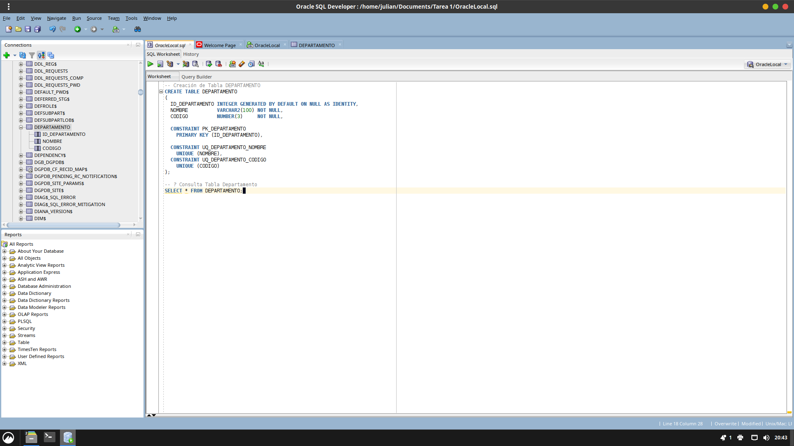
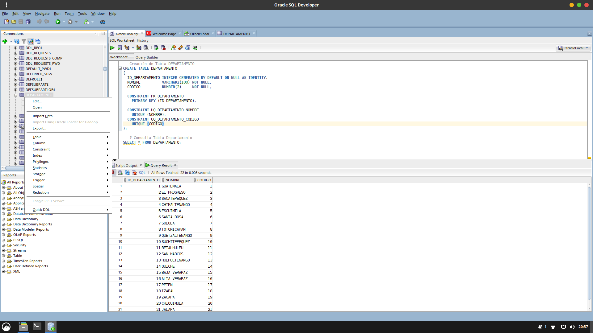
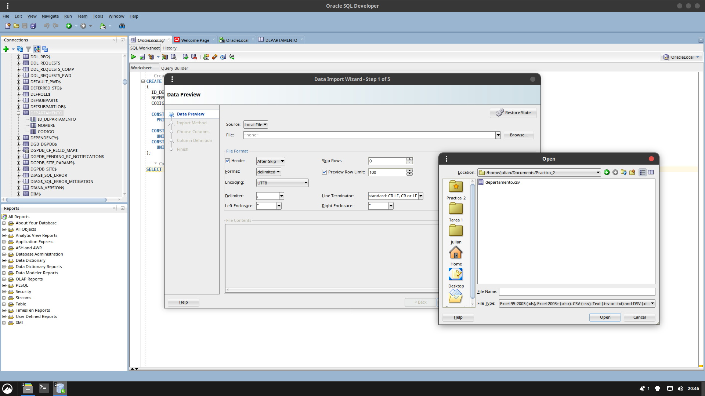
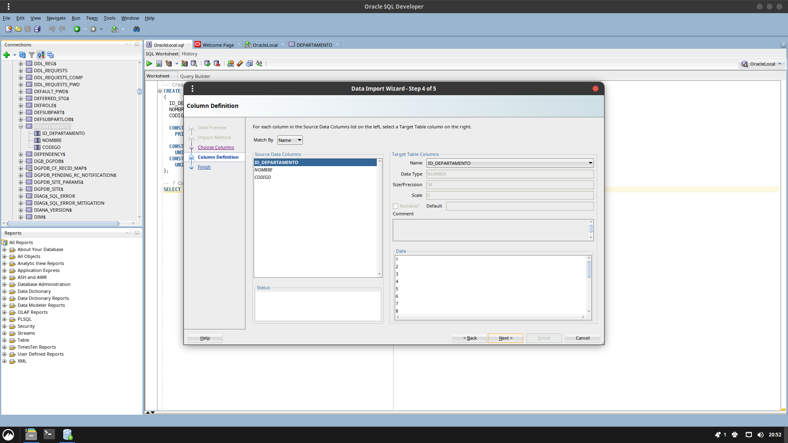
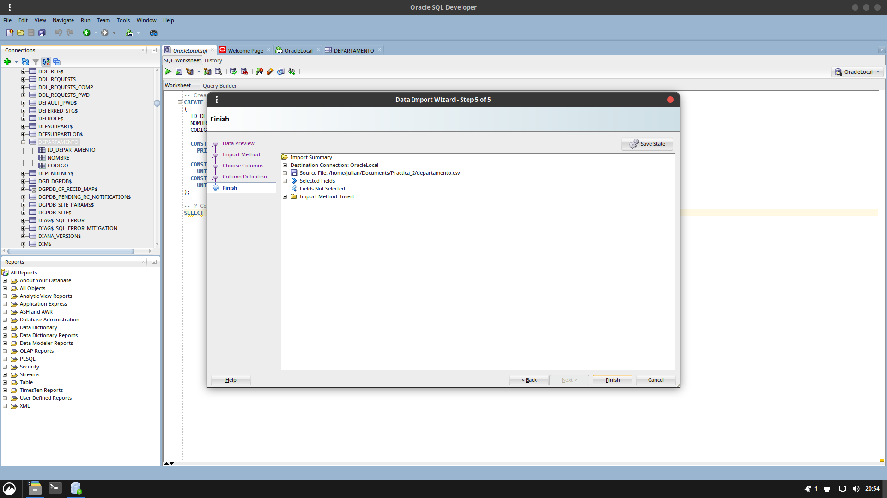

# 📕 Manual de Procedimiento de la Carga de Datos a la Base de Datos

## Índice
- [📕 Manual de Procedimiento de la Carga de Datos a la Base de Datos](#-manual-de-procedimiento-de-la-carga-de-datos-a-la-base-de-datos)
  - [Índice](#índice)
  - [Objetivo General](#objetivo-general)
  - [Objetivos Específicos](#objetivos-específicos)
  - [Introducción](#introducción)
  - [Requisitos Previos](#requisitos-previos)
  - [Configuración del Entorno](#configuración-del-entorno)
  - [SQL DDL y DML](#sql-ddl-y-dml)
    - [SQL DDL](#sql-ddl)
    - [SQL DML](#sql-dml)
  - [Creación de las Tablas](#creación-de-las-tablas)
    - [Tablas Padre](#tablas-padre)
      - [DEPARTAMENTO](#departamento)
    - [ESCUELA](#escuela)
    - [CENTRO](#centro)
    - [CORRELATIVO](#correlativo)
    - [PREGUNTAS (EXAMEN TEÓRICO)](#preguntas-examen-teórico)
    - [PREGUNTAS PRACTICO](#preguntas-practico)
    - [Tablas Hijas](#tablas-hijas)
      - [MUNICIPIO](#municipio)
      - [UBICACION](#ubicacion)
      - [REGISTRO](#registro)
      - [EXAMEN](#examen)
- [Respuestas del Examen](#respuestas-del-examen)
      - [RESPUESTA\_USUARIO](#respuesta_usuario)
      - [RESPUESTA\_PRACTICO\_USUARIO](#respuesta_practico_usuario)
  - [Inserción de Datos Oracle SQL Developer](#inserción-de-datos-oracle-sql-developer)


## Objetivo General

Implementar el modelo de base de datos solicitado para el sistema del **Departamento de Tránsito de Guatemala**, documentando el proceso de creación de tablas y carga de datos.


## Objetivos Específicos

- Configurar un servidor Oracle Database.
- Crear el modelo relacional según el diseño.
- Cargar datos transaccionales desde el archivo Excel.
- Ejecutar consultas SQL sobre los datos cargados.


## Introducción

Este manual describe el proceso completo para preparar el entorno, crear la estructura de la base de datos y cargar los datos del archivo **DATA_inicial.xlsx** en Oracle Database.

Se explica el uso de SQL DDL para definir la estructura y SQL DML para insertar datos.


## Requisitos Previos

- Oracle Database instalado.
- Oracle SQL Developer instalado.
- Permisos de creación de tablas.
- Archivo de datos: DATA_inicial.xlsx


## Configuración del Entorno

1. Instalar Oracle Database XE.
2. Instalar Oracle SQL Developer.
3. Crear conexión a la base de datos.
4. Preparar el archivo Excel de datos.


## SQL DDL y DML

### SQL DDL
Lenguaje para definir estructura de base de datos.

Comandos principales:
- CREATE
- ALTER
- DROP

### SQL DML
Lenguaje para manipular datos.

Comandos principales:
- INSERT
- UPDATE
- DELETE

## Creación de las Tablas

### Tablas Padre

#### DEPARTAMENTO

```sql
-- Creación de Tabla DEPARTAMENTO
CREATE TABLE DEPARTAMENTO 
(
  ID_DEPARTAMENTO INTEGER GENERATED BY DEFAULT ON NULL AS IDENTITY,
  NOMBRE          VARCHAR2(100) NOT NULL,
  CODIGO          NUMBER(3)     NOT NULL,

  CONSTRAINT PK_DEPARTAMENTO 
    PRIMARY KEY (ID_DEPARTAMENTO),

  CONSTRAINT UQ_DEPARTAMENTO_NOMBRE
    UNIQUE (NOMBRE),
  CONSTRAINT UQ_DEPARTAMENTO_CODIGO 
    UNIQUE (CODIGO)
);

-- Inserción de datos en DEPARTAMENTO
INSERT INTO DEPARTAMENTO (NOMBRE, CODIGO) 
  VALUES ('Guatemala', 1);
```

### ESCUELA

```sql
-- Creación de Tabla ESCUELA
CREATE TABLE ESCUELA 
(
  ID_ESCUELA INTEGER GENERATED BY DEFAULT ON NULL AS IDENTITY,
  NOMBRE     VARCHAR2(100) NOT NULL,
  DIRECCION  VARCHAR2(200) NOT NULL,
  ACUERDO    VARCHAR2(50) NOT NULL,

  CONSTRAINT PK_ESCUELA 
    PRIMARY KEY (ID_ESCUELA)
);

-- Inserción de datos en ESCUELA
INSERT INTO ESCUELA (NOMBRE, DIRECCION, ACUERDO) 
  VALUES ('ESCUELA1', 'GUATEMALA ZONA 1', 'A-03-2023');
```

### CENTRO

```sql
-- Creación de Tabla CENTRO
CREATE TABLE CENTRO 
(
  ID_CENTRO INTEGER GENERATED BY DEFAULT ON NULL AS IDENTITY,
  NOMBRE    VARCHAR2(100) NOT NULL,

  CONSTRAINT PK_CENTRO 
    PRIMARY KEY (ID_CENTRO)
);

-- Inserción de datos en CENTRO
INSERT INTO CENTRO (NOMBRE) 
  VALUES ('CENTRO1');
```

### CORRELATIVO

```sql
-- Creación de Tabla CORRELATIVO
CREATE TABLE CORRELATIVO 
(
  ID_CORRELATIVO INTEGER GENERATED BY DEFAULT ON NULL AS IDENTITY,
  FECHA          DATE       NOT NULL,
  NO_EXAMEN      NUMBER(10) NOT NULL,

  CONSTRAINT PK_CORRELATIVO 
    PRIMARY KEY (ID_CORRELATIVO),

  CONSTRAINT UQ_CORRELATIVO_NUMERO 
    UNIQUE (NO_EXAMEN)
);

-- Inserción de datos en CORRELATIVO
INSERT INTO CORRELATIVO (FECHA, NO_EXAMEN) 
  VALUES (TO_DATE('2024-06-01', 'YYYY-MM-DD'),1);
```

### PREGUNTAS (EXAMEN TEÓRICO)

Las preguntas pueden tener menos de 4 opciones.

```sql
-- Creación de Tabla PREGUNTAS
CREATE TABLE PREGUNTAS 
(
  ID_PREGUNTA    INTEGER GENERATED BY DEFAULT ON NULL AS IDENTITY,
  PREGUNTA_TEXTO VARCHAR2(200) NOT NULL,
  RESPUESTA      NUMBER(1)     NOT NULL,
  RES1           VARCHAR2(100)     NULL,
  RES2           VARCHAR2(100)     NULL,
  RES3           VARCHAR2(100)     NULL,
  RES4           VARCHAR2(100)     NULL,

  CONSTRAINT PK_PREGUNTAS 
    PRIMARY KEY (ID_PREGUNTA),

  CONSTRAINT CK_PREGUNTAS_RESP
    CHECK (RESPUESTA BETWEEN 1 AND 4),

  CONSTRAINT CK_PREGUNTAS_RESP_OPCIONES
    CHECK (
      RESPUESTA IS NULL
      OR (RESPUESTA = 1 AND RES1 IS NOT NULL)
      OR (RESPUESTA = 2 AND RES2 IS NOT NULL)
      OR (RESPUESTA = 3 AND RES3 IS NOT NULL)
      OR (RESPUESTA = 4 AND RES4 IS NOT NULL)
    )
);

-- Inserción de datos en PREGUNTAS
INSERT INTO PREGUNTAS (PREGUNTA_TEXTO, RESPUESTA, RES1, RES2, RES3, RES4)
VALUES (q'[¿POR SU PESO COMO SE CLASIFICA UNA MOTOCICLETA?]', 2,
        q'[Pesada]',
        q'[Ligero]',
        q'[Especial]',
        q'[Ninguna es correcta]');
```

### PREGUNTAS PRACTICO

```sql
-- Creación de Tabla PREGUNTAS_PRACTICO
CREATE TABLE PREGUNTAS_PRACTICO 
(
  ID_PREGUNTA_PRACTICO INTEGER GENERATED BY DEFAULT ON NULL AS IDENTITY,
  PREGUNTA_TEXTO       VARCHAR2(200) NOT NULL,
  PUNTEO               NUMBER(3)     NOT NULL,

  CONSTRAINT PK_PREGUNTAS_PRACTICO 
    PRIMARY KEY (ID_PREGUNTA_PRACTICO)

);

-- Inserción de datos en PREGUNTAS_PRACTICO
INSERT INTO PREGUNTAS_PRACTICO (PREGUNTA_TEXTO, PUNTEO)
VALUES (q'[Abrochó y colocó correctamente cinturón de seguridad]', 10);
```

### Tablas Hijas

#### MUNICIPIO

```sql
-- Creación de Tabla MUNICIPIO
CREATE TABLE MUNICIPIO 
(
  ID_MUNICIPIO                 INTEGER GENERATED BY DEFAULT ON NULL AS IDENTITY,
  DEPARTAMENTO_ID_DEPARTAMENTO INTEGER       NOT NULL,
  NOMBRE                       VARCHAR2(100) NOT NULL,
  CODIGO                       NUMBER(3)     NOT NULL,

  CONSTRAINT PK_MUNICIPIO 
    PRIMARY KEY (ID_MUNICIPIO),

  CONSTRAINT FK_MUNICIPIO_DEPARTAMENTO
    FOREIGN KEY (DEPARTAMENTO_ID_DEPARTAMENTO)
    REFERENCES DEPARTAMENTO(ID_DEPARTAMENTO)
    ON DELETE CASCADE,

  CONSTRAINT UQ_MUNICIPIO_DEP_COD 
    UNIQUE (DEPARTAMENTO_ID_DEPARTAMENTO, CODIGO),

  CONSTRAINT UQ_MUNICIPIO_ID_DEP 
    UNIQUE (ID_MUNICIPIO, DEPARTAMENTO_ID_DEPARTAMENTO)
);

-- Inserción de datos en MUNICIPIO
INSERT INTO MUNICIPIO (DEPARTAMENTO_ID_DEPARTAMENTO, NOMBRE, CODIGO) 
  VALUES (1, 'GUATEMALA', 1);
```

#### UBICACION

```sql
-- Creación de Tabla UBICACION
CREATE TABLE UBICACION 
(
  ESCUELA_ID_ESCUELA INTEGER NOT NULL,
  CENTRO_ID_CENTRO   INTEGER NOT NULL,

  CONSTRAINT PK_UBICACION
    PRIMARY KEY (ESCUELA_ID_ESCUELA, CENTRO_ID_CENTRO),

  CONSTRAINT FK_UBICACION_ESCUELA
    FOREIGN KEY (ESCUELA_ID_ESCUELA)
    REFERENCES ESCUELA(ID_ESCUELA)
    ON DELETE CASCADE,

  CONSTRAINT FK_UBICACION_CENTRO
    FOREIGN KEY (CENTRO_ID_CENTRO)
    REFERENCES CENTRO(ID_CENTRO)
    ON DELETE CASCADE
);

-- Inserción de datos en UBICACION
INSERT INTO UBICACION (ESCUELA_ID_ESCUELA, CENTRO_ID_CENT
RO_ID_CENTRO) 
  VALUES (1, 1);
```

#### REGISTRO

```sql
-- Creación de Tabla REGISTRO
CREATE TABLE REGISTRO 
(
  ID_REGISTRO                            INTEGER GENERATED BY DEFAULT ON NULL AS IDENTITY,
  UBICACION_ESCUELA_ID_ESCUELA           INTEGER       NOT NULL,
  UBICACION_CENTRO_ID_CENTRO             INTEGER       NOT NULL,
  MUNICIPIO_ID_MUNICIPIO                 INTEGER       NOT NULL,
  MUNICIPIO_DEPARTAMENTO_ID_DEPARTAMENTO INTEGER       NOT NULL,
  FECHA                                  DATE          NOT NULL,
  TIPO_TRAMITE                           VARCHAR2(30)  NOT NULL,
  TIPO_LICENCIA                          CHAR(1)       NOT NULL,
  NOMBRE_COMPLETO                        VARCHAR2(100) NOT NULL,
  GENERO                                 CHAR(1)       NOT NULL,

  CONSTRAINT PK_REGISTRO 
    PRIMARY KEY (ID_REGISTRO),

  CONSTRAINT FK_REGISTRO_UBICACION
    FOREIGN KEY (UBICACION_ESCUELA_ID_ESCUELA, UBICACION_CENTRO_ID_CENTRO)
    REFERENCES UBICACION(ESCUELA_ID_ESCUELA, CENTRO_ID_CENTRO)
    ON DELETE CASCADE,

  CONSTRAINT FK_REGISTRO_MUNICIPIO_DEP
    FOREIGN KEY (MUNICIPIO_ID_MUNICIPIO, MUNICIPIO_DEPARTAMENTO_ID_DEPARTAMENTO)
    REFERENCES MUNICIPIO(ID_MUNICIPIO, DEPARTAMENTO_ID_DEPARTAMENTO),

  CONSTRAINT CK_REGISTRO_GENERO 
    CHECK (GENERO IN ('M','F'))
);

-- Inserción de datos en REGISTRO
INSERT INTO REGISTRO (UBICACION_ESCUELA_ID_ESCUELA, UBICACION_CENTRO_ID_CENTRO, MUNICIPIO_ID_MUNICIPIO, MUNICIPIO_DEPARTAMENTO_ID_DEPARTAMENTO, FECHA, TIPO_TRAMITE, TIPO_LICENCIA, NOMBRE_COMPLETO, GENERO)
VALUES (1, 1, 1, 1, TO_DATE('2024-06-01', 'YYYY-MM-DD'), 'PRIMER_LICENCIA', 'C', 'JUAN PEREZ', 'M');
```

#### EXAMEN

```sql
-- Creación de Tabla EXAMEN
CREATE TABLE EXAMEN 
(
  ID_EXAMEN                                       INTEGER GENERATED BY DEFAULT ON NULL AS IDENTITY,
  REGISTRO_ID_ESCUELA                             INTEGER NOT NULL,
  REGISTRO_ID_CENTRO                              INTEGER NOT NULL,
  REGISTRO_MUNICIPIO_ID_MUNICIPIO                 INTEGER NOT NULL,
  REGISTRO_MUNICIPIO_DEPARTAMENTO_ID_DEPARTAMENTO INTEGER NOT NULL,
  REGISTRO_ID_REGISTRO                            INTEGER NOT NULL,
  CORRELATIVO_ID_CORRELATIVO                      INTEGER NOT NULL,

  CONSTRAINT PK_EXAMEN 
    PRIMARY KEY (ID_EXAMEN),

  CONSTRAINT FK_EXAMEN_REGISTRO
    FOREIGN KEY (REGISTRO_ID_REGISTRO)
    REFERENCES REGISTRO(ID_REGISTRO)
    ON DELETE CASCADE,

  CONSTRAINT FK_EXAMEN_CORRELATIVO
    FOREIGN KEY (CORRELATIVO_ID_CORRELATIVO)
    REFERENCES CORRELATIVO(ID_CORRELATIVO)
    ON DELETE CASCADE,

  CONSTRAINT UQ_EXAMEN_CORRELATIVO 
    UNIQUE (CORRELATIVO_ID_CORRELATIVO),

  CONSTRAINT FK_EXAMEN_UBICACION
    FOREIGN KEY (REGISTRO_ID_ESCUELA, REGISTRO_ID_CENTRO)
    REFERENCES UBICACION(ESCUELA_ID_ESCUELA, CENTRO_ID_CENTRO),

  CONSTRAINT FK_EXAMEN_MUNICIPIO_DEP
    FOREIGN KEY (REGISTRO_MUNICIPIO_ID_MUNICIPIO, REGISTRO_MUNICIPIO_DEPARTAMENTO_ID_DEPARTAMENTO)
    REFERENCES MUNICIPIO(ID_MUNICIPIO, DEPARTAMENTO_ID_DEPARTAMENTO)
);

-- Inserción de datos en EXAMEN
INSERT INTO EXAMEN (REGISTRO_ID_REGISTRO, CORRELATIVO_ID_CORRELATIVO) 
VALUES (1, 1);
```

# Respuestas del Examen

#### RESPUESTA_USUARIO

```sql
-- Creación de Tabla RESPUESTA_USUARIO
CREATE TABLE RESPUESTA_USUARIO 
(
  ID_RESPUESTA_USUARIO INTEGER GENERATED BY DEFAULT ON NULL AS IDENTITY,
  PREGUNTA_ID_PREGUNTA INTEGER   NOT NULL,
  EXAMEN_ID_EXAMEN     INTEGER   NOT NULL,
  RESPUESTA            NUMBER(1) NOT NULL,

  CONSTRAINT PK_RESPUESTA_USUARIO 
    PRIMARY KEY (ID_RESPUESTA_USUARIO),

  CONSTRAINT FK_RESP_USUARIO_PREGUNTA
    FOREIGN KEY (PREGUNTA_ID_PREGUNTA)
    REFERENCES PREGUNTAS(ID_PREGUNTA),

  CONSTRAINT FK_RESP_USUARIO_EXAMEN
    FOREIGN KEY (EXAMEN_ID_EXAMEN)
    REFERENCES EXAMEN(ID_EXAMEN)
    ON DELETE CASCADE,

  CONSTRAINT CK_RESP_USUARIO_RESP 
    CHECK (RESPUESTA BETWEEN 1 AND 4),

  CONSTRAINT UQ_RESP_USUARIO_EXAMEN_PREG 
    UNIQUE (EXAMEN_ID_EXAMEN, PREGUNTA_ID_PREGUNTA)
);

-- Inserción de datos en RESPUESTA_USUARIO
INSERT INTO RESPUESTA_USUARIO (PREGUNTA_ID_PREGUNTA, EXAMEN_ID_EXAMEN, RESPUESTA) VALUES (1,1,3);
```

#### RESPUESTA_PRACTICO_USUARIO

```sql
-- Creación de Tabla RESPUESTA_PRACTICO_USUARIO
CREATE TABLE RESPUESTA_PRACTICO_USUARIO 
(
  ID_RESPUESTA_PRACTICO                  INTEGER GENERATED BY DEFAULT ON NULL AS IDENTITY,
  PREGUNTA_PRACTICO_ID_PREGUNTA_PRACTICO INTEGER   NOT NULL,
  EXAMEN_ID_EXAMEN                       INTEGER   NOT NULL,
  NOTA                                   NUMBER(3) NOT NULL,

  CONSTRAINT PK_RESPUESTA_PRACTICO_USUARIO 
    PRIMARY KEY (ID_RESPUESTA_PRACTICO),

  CONSTRAINT FK_RESP_PRACTICO_PREG
    FOREIGN KEY (PREGUNTA_PRACTICO_ID_PREGUNTA_PRACTICO)
    REFERENCES PREGUNTAS_PRACTICO(ID_PREGUNTA_PRACTICO),

  CONSTRAINT FK_RESP_PRACTICO_EXAMEN
    FOREIGN KEY (EXAMEN_ID_EXAMEN)
    REFERENCES EXAMEN(ID_EXAMEN)
    ON DELETE CASCADE,

  CONSTRAINT UQ_RESP_PRACTICO_EXAMEN_PREG 
    UNIQUE (EXAMEN_ID_EXAMEN, PREGUNTA_PRACTICO_ID_PREGUNTA_PRACTICO)
);

-- Inserción de datos en RESPUESTA_PRACTICO_USUARIO
INSERT INTO RESPUESTA_PRACTICO_USUARIO (PREGUNTA_PRACTICO_ID_PREGUNTA_PRACTICO, EXAMEN_ID_EXAMEN, NOTA) 
VALUES (1, 1, 9);
```

## Inserción de Datos Oracle SQL Developer

1. Abrir Oracle SQL Developer.
2. Conectar a la base de datos.
3. Crear un nuevo script SQL.
4. Copiar y pegar el código SQL para crear tablas.
5. Ejecutar el script para crear la estructura.
   


6. Insertar datos utilizando el exportador de Excel a SQL Developer.



- Seleccionar el archivo Excel (DATA_inicial.xlsx) para importar los datos.



- Seleccionar el archivo en formato CSV.
- Se cargarán los datos en la previsualización de la tabla correspondiente.


- Next, seleccionamos el metodo de inserción, en este caso, "Insertar" para generar sentencias SQL INSERT.

- Especificamos el row limit, por ejemplo, 1000 filas.


- Seleccionamos las columnas correspondientes a cada campo de la tabla.



- Definimos el formato de cada campo, especialmente para fechas.



- Se insertan los datos en la tabla seleccionada.

1. Consulta de datos para verificar la inserción.

```sql
SELECT * FROM DEPARTAMENTO;
```

